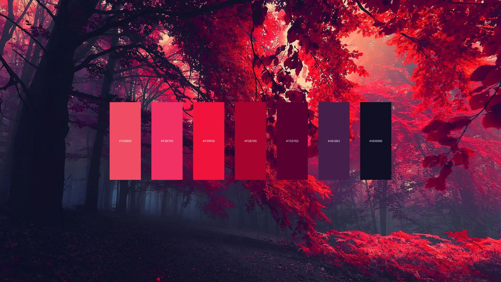
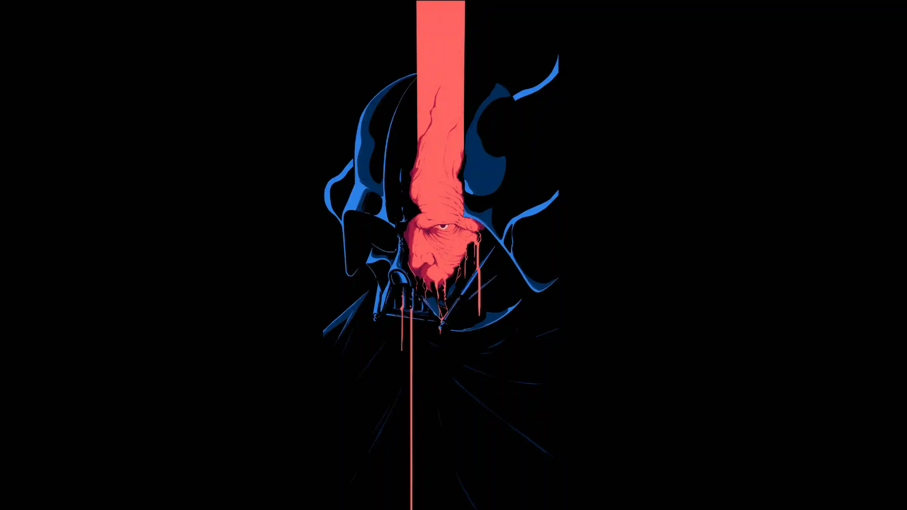
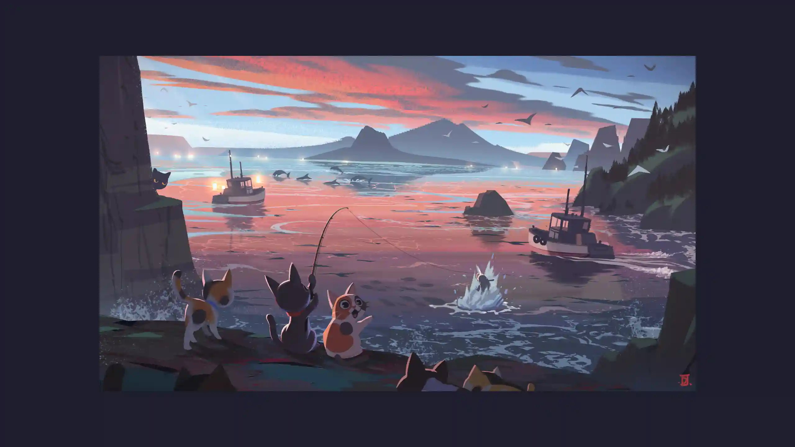

<h1 align="center">
  These wallpapers are NOT MINE 
  Credits go to their respective owners!
</h1>

> **_preview/_** is exclusively for **low-res** image previews. 
> **_images/_** will have the original images.

Click to show/hide wallpapers preview.

 

<table align="center">
        <tr>
            <td align="center"></td>
            <td align="center"><a href="https://github.com/Kamimusuhi/wallpapers/blob/main/images/0001.png" style="font-size: 20px;">0001</a></td>
        </tr>
        <tr>
            <td align="center"></td>
            <td align="center"><a href="https://github.com/Kamimusuhi/wallpapers/blob/main/images/0002.png" style="font-size: 20px;">0002</a></td>
        </tr>
        <tr>
            <td align="center"></td>
            <td align="center"><a href="https://github.com/Kamimusuhi/wallpapers/blob/main/images/0003.png" style="font-size: 20px;">0003</a></td>
        </tr>
        <tr>
            <td align="center"></td>
            <td align="center"><a href="https://github.com/Kamimusuhi/wallpapers/blob/main/images/0004.png" style="font-size: 20px;">0004</a></td>
        </tr>
        <tr>
            <td align="center"></td>
            <td align="center"><a href="https://github.com/Kamimusuhi/wallpapers/blob/main/images/0005.png" style="font-size: 20px;">0005</a></td>
        </tr>
        <tr>
            <td align="center"></td>
            <td align="center"><a href="https://github.com/Kamimusuhi/wallpapers/blob/main/images/0006.png" style="font-size: 20px;">0006</a></td>
        </tr>
        <tr>
            <td align="center"></td>
            <td align="center"><a href="https://github.com/Kamimusuhi/wallpapers/blob/main/images/0007.png" style="font-size: 20px;">0007</a></td>
        </tr>
        <tr>
            <td align="center"></td>
            <td align="center"><a href="https://github.com/Kamimusuhi/wallpapers/blob/main/images/0008.png" style="font-size: 20px;">0008</a></td>
        </tr>
        <tr>
            <td align="center"></td>
            <td align="center"><a href="https://github.com/Kamimusuhi/wallpapers/blob/main/images/0009.png" style="font-size: 20px;">0009</a></td>
        </tr>
        <tr>
            <td align="center"></td>
            <td align="center"><a href="https://github.com/Kamimusuhi/wallpapers/blob/main/images/0010.png" style="font-size: 20px;">0010</a></td>
        </tr>
        <tr>
            <td align="center"></td>
            <td align="center"><a href="https://github.com/Kamimusuhi/wallpapers/blob/main/images/0011.png" style="font-size: 20px;">0011</a></td>
        </tr>
        <tr>
            <td align="center"></td>
            <td align="center"><a href="https://github.com/Kamimusuhi/wallpapers/blob/main/images/0012.png" style="font-size: 20px;">0012</a></td>
        </tr>
        <tr>
            <td align="center"></td>
            <td align="center"><a href="https://github.com/Kamimusuhi/wallpapers/blob/main/images/0013.png" style="font-size: 20px;">0013</a></td>
        </tr>
        <tr>
            <td align="center"></td>
            <td align="center"><a href="https://github.com/Kamimusuhi/wallpapers/blob/main/images/0014.png" style="font-size: 20px;">0014</a></td>
        </tr>
        <tr>
            <td align="center"></td>
            <td align="center"><a href="https://github.com/Kamimusuhi/wallpapers/blob/main/images/0015.png" style="font-size: 20px;">0015</a></td>
        </tr>
        <tr>
            <td align="center"></td>
            <td align="center"><a href="https://github.com/Kamimusuhi/wallpapers/blob/main/images/0016.png" style="font-size: 20px;">0016</a></td>
        </tr>
        <tr>
            <td align="center"></td>
            <td align="center"><a href="https://github.com/Kamimusuhi/wallpapers/blob/main/images/0017.png" style="font-size: 20px;">0017</a></td>
        </tr>
        <tr>
            <td align="center"></td>
            <td align="center"><a href="https://github.com/Kamimusuhi/wallpapers/blob/main/images/0018.png" style="font-size: 20px;">0018</a></td>
        </tr>
        <tr>
            <td align="center"></td>
            <td align="center"><a href="https://github.com/Kamimusuhi/wallpapers/blob/main/images/0019.png" style="font-size: 20px;">0019</a></td>
        </tr>
        <tr>
            <td align="center"></td>
            <td align="center"><a href="https://github.com/Kamimusuhi/wallpapers/blob/main/images/0020.png" style="font-size: 20px;">0020</a></td>
        </tr>
        <tr>
            <td align="center"></td>
            <td align="center"><a href="https://github.com/Kamimusuhi/wallpapers/blob/main/images/0021.png" style="font-size: 20px;">0021</a></td>
        </tr>
        <tr>
            <td align="center"></td>
            <td align="center"><a href="https://github.com/Kamimusuhi/wallpapers/blob/main/images/0022.png" style="font-size: 20px;">0022</a></td>
        </tr>
        <tr>
            <td align="center"></td>
            <td align="center"><a href="https://github.com/Kamimusuhi/wallpapers/blob/main/images/0023.png" style="font-size: 20px;">0023</a></td>
        </tr>
        <tr>
            <td align="center"></td>
            <td align="center"><a href="https://github.com/Kamimusuhi/wallpapers/blob/main/images/0024.png" style="font-size: 20px;">0024</a></td>
        </tr>
        <tr>
            <td align="center"></td>
            <td align="center"><a href="https://github.com/Kamimusuhi/wallpapers/blob/main/images/0025.png" style="font-size: 20px;">0025</a></td>
        </tr>
        <tr>
            <td align="center"></td>
            <td align="center"><a href="https://github.com/Kamimusuhi/wallpapers/blob/main/images/0026.png" style="font-size: 20px;">0026</a></td>
        </tr>
        <tr>
            <td align="center"></td>
            <td align="center"><a href="https://github.com/Kamimusuhi/wallpapers/blob/main/images/0027.png" style="font-size: 20px;">0027</a></td>
        </tr>
        <tr>
            <td align="center"></td>
            <td align="center"><a href="https://github.com/Kamimusuhi/wallpapers/blob/main/images/0028.png" style="font-size: 20px;">0028</a></td>
        </tr>
        <tr>
            <td align="center"></td>
            <td align="center"><a href="https://github.com/Kamimusuhi/wallpapers/blob/main/images/0029.png" style="font-size: 20px;">0029</a></td>
        </tr>
        <tr>
            <td align="center"></td>
            <td align="center"><a href="https://github.com/Kamimusuhi/wallpapers/blob/main/images/0030.png" style="font-size: 20px;">0030</a></td>
        </tr>
        <tr>
            <td align="center"></td>
            <td align="center"><a href="https://github.com/Kamimusuhi/wallpapers/blob/main/images/0031.png" style="font-size: 20px;">0031</a></td>
        </tr>
        <tr>
            <td align="center"></td>
            <td align="center"><a href="https://github.com/Kamimusuhi/wallpapers/blob/main/images/0032.png" style="font-size: 20px;">0032</a></td>
        </tr>
        <tr>
            <td align="center"></td>
            <td align="center"><a href="https://github.com/Kamimusuhi/wallpapers/blob/main/images/0033.png" style="font-size: 20px;">0033</a></td>
        </tr>
        <tr>
            <td align="center"></td>
            <td align="center"><a href="https://github.com/Kamimusuhi/wallpapers/blob/main/images/0034.png" style="font-size: 20px;">0034</a></td>
        </tr>
        <tr>
            <td align="center"></td>
            <td align="center"><a href="https://github.com/Kamimusuhi/wallpapers/blob/main/images/0035.png" style="font-size: 20px;">0035</a></td>
        </tr>
        <tr>
            <td align="center"></td>
            <td align="center"><a href="https://github.com/Kamimusuhi/wallpapers/blob/main/images/0036.png" style="font-size: 20px;">0036</a></td>
        </tr>
        <tr>
            <td align="center"></td>
            <td align="center"><a href="https://github.com/Kamimusuhi/wallpapers/blob/main/images/0037.png" style="font-size: 20px;">0037</a></td>
        </tr>
        <tr>
            <td align="center"></td>
            <td align="center"><a href="https://github.com/Kamimusuhi/wallpapers/blob/main/images/0038.png" style="font-size: 20px;">0038</a></td>
        </tr>
        <tr>
            <td align="center"></td>
            <td align="center"><a href="https://github.com/Kamimusuhi/wallpapers/blob/main/images/0039.png" style="font-size: 20px;">0039</a></td>
        </tr>
        <tr>
            <td align="center"></td>
            <td align="center"><a href="https://github.com/Kamimusuhi/wallpapers/blob/main/images/0040.png" style="font-size: 20px;">0040</a></td>
        </tr>
        <tr>
            <td align="center"></td>
            <td align="center"><a href="https://github.com/Kamimusuhi/wallpapers/blob/main/images/0041.png" style="font-size: 20px;">0041</a></td>
        </tr>
        <tr>
            <td align="center"></td>
            <td align="center"><a href="https://github.com/Kamimusuhi/wallpapers/blob/main/images/0042.png" style="font-size: 20px;">0042</a></td>
        </tr>
        <tr>
            <td align="center"></td>
            <td align="center"><a href="https://github.com/Kamimusuhi/wallpapers/blob/main/images/0043.png" style="font-size: 20px;">0043</a></td>
        </tr>
        <tr>
            <td align="center"></td>
            <td align="center"><a href="https://github.com/Kamimusuhi/wallpapers/blob/main/images/0044.png" style="font-size: 20px;">0044</a></td>
        </tr>
        <tr>
            <td align="center"></td>
            <td align="center"><a href="https://github.com/Kamimusuhi/wallpapers/blob/main/images/0045.png" style="font-size: 20px;">0045</a></td>
        </tr>
        <tr>
            <td align="center"></td>
            <td align="center"><a href="https://github.com/Kamimusuhi/wallpapers/blob/main/images/0046.png" style="font-size: 20px;">0046</a></td>
        </tr>
        <tr>
            <td align="center"></td>
            <td align="center"><a href="https://github.com/Kamimusuhi/wallpapers/blob/main/images/0047.png" style="font-size: 20px;">0047</a></td>
        </tr>
        <tr>
            <td align="center"></td>
            <td align="center"><a href="https://github.com/Kamimusuhi/wallpapers/blob/main/images/0048.png" style="font-size: 20px;">0048</a></td>
        </tr>
        <tr>
            <td align="center"></td>
            <td align="center"><a href="https://github.com/Kamimusuhi/wallpapers/blob/main/images/0049.png" style="font-size: 20px;">0049</a></td>
        </tr>
        <tr>
            <td align="center"></td>
            <td align="center"><a href="https://github.com/Kamimusuhi/wallpapers/blob/main/images/0050.png" style="font-size: 20px;">0050</a></td>
        </tr>
        <tr>
            <td align="center"></td>
            <td align="center"><a href="https://github.com/Kamimusuhi/wallpapers/blob/main/images/0051.png" style="font-size: 20px;">0051</a></td>
        </tr>
        <tr>
            <td align="center"></td>
            <td align="center"><a href="https://github.com/Kamimusuhi/wallpapers/blob/main/images/0052.png" style="font-size: 20px;">0052</a></td>
        </tr>
        <tr>
            <td align="center"></td>
            <td align="center"><a href="https://github.com/Kamimusuhi/wallpapers/blob/main/images/0053.png" style="font-size: 20px;">0053</a></td>
        </tr>
        <tr>
            <td align="center"></td>
            <td align="center"><a href="https://github.com/Kamimusuhi/wallpapers/blob/main/images/0054.png" style="font-size: 20px;">0054</a></td>
        </tr>
        <tr>
            <td align="center"></td>
            <td align="center"><a href="https://github.com/Kamimusuhi/wallpapers/blob/main/images/0055.png" style="font-size: 20px;">0055</a></td>
        </tr>
        <tr>
            <td align="center"></td>
            <td align="center"><a href="https://github.com/Kamimusuhi/wallpapers/blob/main/images/0056.png" style="font-size: 20px;">0056</a></td>
        </tr>
        <tr>
            <td align="center"></td>
            <td align="center"><a href="https://github.com/Kamimusuhi/wallpapers/blob/main/images/0057.png" style="font-size: 20px;">0057</a></td>
        </tr>
        <tr>
            <td align="center"></td>
            <td align="center"><a href="https://github.com/Kamimusuhi/wallpapers/blob/main/images/0058.png" style="font-size: 20px;">0058</a></td>
        </tr>
        <tr>
            <td align="center"></td>
            <td align="center"><a href="https://github.com/Kamimusuhi/wallpapers/blob/main/images/0059.png" style="font-size: 20px;">0059</a></td>
        </tr>
        <tr>
            <td align="center"></td>
            <td align="center"><a href="https://github.com/Kamimusuhi/wallpapers/blob/main/images/0060.png" style="font-size: 20px;">0060</a></td>
        </tr>
        <tr>
            <td align="center"></td>
            <td align="center"><a href="https://github.com/Kamimusuhi/wallpapers/blob/main/images/0061.png" style="font-size: 20px;">0061</a></td>
        </tr>
        <tr>
            <td align="center"></td>
            <td align="center"><a href="https://github.com/Kamimusuhi/wallpapers/blob/main/images/0062.png" style="font-size: 20px;">0062</a></td>
        </tr>
        <tr>
            <td align="center"></td>
            <td align="center"><a href="https://github.com/Kamimusuhi/wallpapers/blob/main/images/0063.png" style="font-size: 20px;">0063</a></td>
        </tr>
        <tr>
            <td align="center"></td>
            <td align="center"><a href="https://github.com/Kamimusuhi/wallpapers/blob/main/images/0064.png" style="font-size: 20px;">0064</a></td>
        </tr>
        <tr>
            <td align="center"></td>
            <td align="center"><a href="https://github.com/Kamimusuhi/wallpapers/blob/main/images/0065.png" style="font-size: 20px;">0065</a></td>
        </tr>
        <tr>
            <td align="center"></td>
            <td align="center"><a href="https://github.com/Kamimusuhi/wallpapers/blob/main/images/0066.png" style="font-size: 20px;">0066</a></td>
        </tr>
        <tr>
            <td align="center"></td>
            <td align="center"><a href="https://github.com/Kamimusuhi/wallpapers/blob/main/images/0067.png" style="font-size: 20px;">0067</a></td>
        </tr>
        <tr>
            <td align="center"></td>
            <td align="center"><a href="https://github.com/Kamimusuhi/wallpapers/blob/main/images/0068.png" style="font-size: 20px;">0068</a></td>
        </tr>
        <tr>
            <td align="center"></td>
            <td align="center"><a href="https://github.com/Kamimusuhi/wallpapers/blob/main/images/0069.png" style="font-size: 20px;">0069</a></td>
        </tr>
        <tr>
            <td align="center"></td>
            <td align="center"><a href="https://github.com/Kamimusuhi/wallpapers/blob/main/images/0070.png" style="font-size: 20px;">0070</a></td>
        </tr>
        <tr>
            <td align="center"></td>
            <td align="center"><a href="https://github.com/Kamimusuhi/wallpapers/blob/main/images/0071.png" style="font-size: 20px;">0071</a></td>
        </tr>
        <tr>
            <td align="center"></td>
            <td align="center"><a href="https://github.com/Kamimusuhi/wallpapers/blob/main/images/0072.png" style="font-size: 20px;">0072</a></td>
        </tr>
        <tr>
            <td align="center"></td>
            <td align="center"><a href="https://github.com/Kamimusuhi/wallpapers/blob/main/images/0073.png" style="font-size: 20px;">0073</a></td>
        </tr>
        <tr>
            <td align="center"></td>
            <td align="center"><a href="https://github.com/Kamimusuhi/wallpapers/blob/main/images/0074.png" style="font-size: 20px;">0074</a></td>
        </tr>
        <tr>
            <td align="center"></td>
            <td align="center"><a href="https://github.com/Kamimusuhi/wallpapers/blob/main/images/0075.png" style="font-size: 20px;">0075</a></td>
        </tr>
        <tr>
            <td align="center"></td>
            <td align="center"><a href="https://github.com/Kamimusuhi/wallpapers/blob/main/images/0076.png" style="font-size: 20px;">0076</a></td>
        </tr>
        <tr>
            <td align="center"></td>
            <td align="center"><a href="https://github.com/Kamimusuhi/wallpapers/blob/main/images/0077.png" style="font-size: 20px;">0077</a></td>
        </tr>
        <tr>
            <td align="center"></td>
            <td align="center"><a href="https://github.com/Kamimusuhi/wallpapers/blob/main/images/0078.png" style="font-size: 20px;">0078</a></td>
        </tr>
        <tr>
            <td align="center"></td>
            <td align="center"><a href="https://github.com/Kamimusuhi/wallpapers/blob/main/images/0079.png" style="font-size: 20px;">0079</a></td>
        </tr>
        <tr>
            <td align="center"></td>
            <td align="center"><a href="https://github.com/Kamimusuhi/wallpapers/blob/main/images/0080.png" style="font-size: 20px;">0080</a></td>
        </tr>
        <tr>
            <td align="center"></td>
            <td align="center"><a href="https://github.com/Kamimusuhi/wallpapers/blob/main/images/0081.png" style="font-size: 20px;">0081</a></td>
        </tr>
        <tr>
            <td align="center"></td>
            <td align="center"><a href="https://github.com/Kamimusuhi/wallpapers/blob/main/images/0082.png" style="font-size: 20px;">0082</a></td>
        </tr>
        <tr>
            <td align="center"></td>
            <td align="center"><a href="https://github.com/Kamimusuhi/wallpapers/blob/main/images/0083.png" style="font-size: 20px;">0083</a></td>
        </tr>
        <tr>
            <td align="center"></td>
            <td align="center"><a href="https://github.com/Kamimusuhi/wallpapers/blob/main/images/0084.png" style="font-size: 20px;">0084</a></td>
        </tr>
        <tr>
            <td align="center"></td>
            <td align="center"><a href="https://github.com/Kamimusuhi/wallpapers/blob/main/images/0085.png" style="font-size: 20px;">0085</a></td>
        </tr>
        <tr>
            <td align="center"></td>
            <td align="center"><a href="https://github.com/Kamimusuhi/wallpapers/blob/main/images/0086.png" style="font-size: 20px;">0086</a></td>
        </tr>
        <tr>
            <td align="center"></td>
            <td align="center"><a href="https://github.com/Kamimusuhi/wallpapers/blob/main/images/0087.png" style="font-size: 20px;">0087</a></td>
        </tr>
        <tr>
            <td align="center"></td>
            <td align="center"><a href="https://github.com/Kamimusuhi/wallpapers/blob/main/images/0088.png" style="font-size: 20px;">0088</a></td>
        </tr>
        <tr>
            <td align="center"></td>
            <td align="center"><a href="https://github.com/Kamimusuhi/wallpapers/blob/main/images/0089.png" style="font-size: 20px;">0089</a></td>
        </tr>
        <tr>
            <td align="center"></td>
            <td align="center"><a href="https://github.com/Kamimusuhi/wallpapers/blob/main/images/0090.png" style="font-size: 20px;">0090</a></td>
        </tr>
        <tr>
            <td align="center"></td>
            <td align="center"><a href="https://github.com/Kamimusuhi/wallpapers/blob/main/images/0091.png" style="font-size: 20px;">0091</a></td>
        </tr>
        <tr>
            <td align="center"></td>
            <td align="center"><a href="https://github.com/Kamimusuhi/wallpapers/blob/main/images/0092.png" style="font-size: 20px;">0092</a></td>
        </tr>
        <tr>
            <td align="center"></td>
            <td align="center"><a href="https://github.com/Kamimusuhi/wallpapers/blob/main/images/0093.png" style="font-size: 20px;">0093</a></td>
        </tr>
        <tr>
            <td align="center"></td>
            <td align="center"><a href="https://github.com/Kamimusuhi/wallpapers/blob/main/images/0094.png" style="font-size: 20px;">0094</a></td>
        </tr>
        <tr>
            <td align="center"></td>
            <td align="center"><a href="https://github.com/Kamimusuhi/wallpapers/blob/main/images/0095.png" style="font-size: 20px;">0095</a></td>
        </tr>
        <tr>
            <td align="center"></td>
            <td align="center"><a href="https://github.com/Kamimusuhi/wallpapers/blob/main/images/0096.png" style="font-size: 20px;">0096</a></td>
        </tr>
        <tr>
            <td align="center"></td>
            <td align="center"><a href="https://github.com/Kamimusuhi/wallpapers/blob/main/images/0097.png" style="font-size: 20px;">0097</a></td>
        </tr>
        <tr>
            <td align="center"></td>
            <td align="center"><a href="https://github.com/Kamimusuhi/wallpapers/blob/main/images/0098.png" style="font-size: 20px;">0098</a></td>
        </tr>
        <tr>
            <td align="center"></td>
            <td align="center"><a href="https://github.com/Kamimusuhi/wallpapers/blob/main/images/0099.png" style="font-size: 20px;">0099</a></td>
        </tr>
        <tr>
            <td align="center"></td>
            <td align="center"><a href="https://github.com/Kamimusuhi/wallpapers/blob/main/images/0100.png" style="font-size: 20px;">0100</a></td>
        </tr>
        <tr>
            <td align="center"></td>
            <td align="center"><a href="https://github.com/Kamimusuhi/wallpapers/blob/main/images/0101.png" style="font-size: 20px;">0101</a></td>
        </tr>
        <tr>
            <td align="center"></td>
            <td align="center"><a href="https://github.com/Kamimusuhi/wallpapers/blob/main/images/0102.png" style="font-size: 20px;">0102</a></td>
        </tr>
        <tr>
            <td align="center"></td>
            <td align="center"><a href="https://github.com/Kamimusuhi/wallpapers/blob/main/images/0103.png" style="font-size: 20px;">0103</a></td>
        </tr>
        <tr>
            <td align="center"></td>
            <td align="center"><a href="https://github.com/Kamimusuhi/wallpapers/blob/main/images/0104.png" style="font-size: 20px;">0104</a></td>
        </tr>
        <tr>
            <td align="center"></td>
            <td align="center"><a href="https://github.com/Kamimusuhi/wallpapers/blob/main/images/0105.png" style="font-size: 20px;">0105</a></td>
        </tr>
        <tr>
            <td align="center"></td>
            <td align="center"><a href="https://github.com/Kamimusuhi/wallpapers/blob/main/images/0106.png" style="font-size: 20px;">0106</a></td>
        </tr>
        <tr>
            <td align="center"></td>
            <td align="center"><a href="https://github.com/Kamimusuhi/wallpapers/blob/main/images/0107.png" style="font-size: 20px;">0107</a></td>
        </tr>
        <tr>
            <td align="center"></td>
            <td align="center"><a href="https://github.com/Kamimusuhi/wallpapers/blob/main/images/0108.png" style="font-size: 20px;">0108</a></td>
        </tr>
        <tr>
            <td align="center"></td>
            <td align="center"><a href="https://github.com/Kamimusuhi/wallpapers/blob/main/images/0109.png" style="font-size: 20px;">0109</a></td>
        </tr>
        <tr>
            <td align="center"></td>
            <td align="center"><a href="https://github.com/Kamimusuhi/wallpapers/blob/main/images/0110.png" style="font-size: 20px;">0110</a></td>
        </tr>
        <tr>
            <td align="center"></td>
            <td align="center"><a href="https://github.com/Kamimusuhi/wallpapers/blob/main/images/0111.png" style="font-size: 20px;">0111</a></td>
        </tr>
        <tr>
            <td align="center"></td>
            <td align="center"><a href="https://github.com/Kamimusuhi/wallpapers/blob/main/images/0112.png" style="font-size: 20px;">0112</a></td>
        </tr>
        <tr>
            <td align="center"></td>
            <td align="center"><a href="https://github.com/Kamimusuhi/wallpapers/blob/main/images/0113.png" style="font-size: 20px;">0113</a></td>
        </tr>
        <tr>
            <td align="center"></td>
            <td align="center"><a href="https://github.com/Kamimusuhi/wallpapers/blob/main/images/0114.png" style="font-size: 20px;">0114</a></td>
        </tr>
        <tr>
            <td align="center"></td>
            <td align="center"><a href="https://github.com/Kamimusuhi/wallpapers/blob/main/images/0115.png" style="font-size: 20px;">0115</a></td>
        </tr>
        <tr>
            <td align="center"></td>
            <td align="center"><a href="https://github.com/Kamimusuhi/wallpapers/blob/main/images/0116.png" style="font-size: 20px;">0116</a></td>
        </tr>
        <tr>
            <td align="center"></td>
            <td align="center"><a href="https://github.com/Kamimusuhi/wallpapers/blob/main/images/0117.png" style="font-size: 20px;">0117</a></td>
        </tr>
        <tr>
            <td align="center"></td>
            <td align="center"><a href="https://github.com/Kamimusuhi/wallpapers/blob/main/images/0118.png" style="font-size: 20px;">0118</a></td>
        </tr>
        <tr>
            <td align="center"></td>
            <td align="center"><a href="https://github.com/Kamimusuhi/wallpapers/blob/main/images/0119.png" style="font-size: 20px;">0119</a></td>
        </tr>
        <tr>
            <td align="center"></td>
            <td align="center"><a href="https://github.com/Kamimusuhi/wallpapers/blob/main/images/0120.png" style="font-size: 20px;">0120</a></td>
        </tr>
        <tr>
            <td align="center"></td>
            <td align="center"><a href="https://github.com/Kamimusuhi/wallpapers/blob/main/images/0121.png" style="font-size: 20px;">0121</a></td>
        </tr>
        <tr>
            <td align="center"></td>
            <td align="center"><a href="https://github.com/Kamimusuhi/wallpapers/blob/main/images/0122.png" style="font-size: 20px;">0122</a></td>
        </tr>
        <tr>
            <td align="center"></td>
            <td align="center"><a href="https://github.com/Kamimusuhi/wallpapers/blob/main/images/0123.png" style="font-size: 20px;">0123</a></td>
        </tr>
        <tr>
            <td align="center"></td>
            <td align="center"><a href="https://github.com/Kamimusuhi/wallpapers/blob/main/images/0124.png" style="font-size: 20px;">0124</a></td>
        </tr>
        <tr>
            <td align="center"></td>
            <td align="center"><a href="https://github.com/Kamimusuhi/wallpapers/blob/main/images/0125.png" style="font-size: 20px;">0125</a></td>
        </tr>
        <tr>
            <td align="center"></td>
            <td align="center"><a href="https://github.com/Kamimusuhi/wallpapers/blob/main/images/0126.png" style="font-size: 20px;">0126</a></td>
        </tr>
        <tr>
            <td align="center"></td>
            <td align="center"><a href="https://github.com/Kamimusuhi/wallpapers/blob/main/images/0127.png" style="font-size: 20px;">0127</a></td>
        </tr>
        <tr>
            <td align="center"></td>
            <td align="center"><a href="https://github.com/Kamimusuhi/wallpapers/blob/main/images/0128.png" style="font-size: 20px;">0128</a></td>
        </tr>
        <tr>
            <td align="center"></td>
            <td align="center"><a href="https://github.com/Kamimusuhi/wallpapers/blob/main/images/0129.png" style="font-size: 20px;">0129</a></td>
        </tr>
        <tr>
            <td align="center"></td>
            <td align="center"><a href="https://github.com/Kamimusuhi/wallpapers/blob/main/images/0130.png" style="font-size: 20px;">0130</a></td>
        </tr>
        <tr>
            <td align="center"></td>
            <td align="center"><a href="https://github.com/Kamimusuhi/wallpapers/blob/main/images/0131.png" style="font-size: 20px;">0131</a></td>
        </tr>
        <tr>
            <td align="center"></td>
            <td align="center"><a href="https://github.com/Kamimusuhi/wallpapers/blob/main/images/0132.png" style="font-size: 20px;">0132</a></td>
        </tr>
        <tr>
            <td align="center"></td>
            <td align="center"><a href="https://github.com/Kamimusuhi/wallpapers/blob/main/images/0133.png" style="font-size: 20px;">0133</a></td>
        </tr>
        <tr>
            <td align="center"></td>
            <td align="center"><a href="https://github.com/Kamimusuhi/wallpapers/blob/main/images/0134.png" style="font-size: 20px;">0134</a></td>
        </tr>
        <tr>
            <td align="center"></td>
            <td align="center"><a href="https://github.com/Kamimusuhi/wallpapers/blob/main/images/0135.png" style="font-size: 20px;">0135</a></td>
        </tr>
        <tr>
            <td align="center"></td>
            <td align="center"><a href="https://github.com/Kamimusuhi/wallpapers/blob/main/images/0136.png" style="font-size: 20px;">0136</a></td>
        </tr>
        <tr>
            <td align="center"></td>
            <td align="center"><a href="https://github.com/Kamimusuhi/wallpapers/blob/main/images/0137.png" style="font-size: 20px;">0137</a></td>
        </tr>
        <tr>
            <td align="center"></td>
            <td align="center"><a href="https://github.com/Kamimusuhi/wallpapers/blob/main/images/0138.png" style="font-size: 20px;">0138</a></td>
        </tr>
        <tr>
            <td align="center"></td>
            <td align="center"><a href="https://github.com/Kamimusuhi/wallpapers/blob/main/images/0139.png" style="font-size: 20px;">0139</a></td>
        </tr>
        <tr>
            <td align="center"></td>
            <td align="center"><a href="https://github.com/Kamimusuhi/wallpapers/blob/main/images/0140.png" style="font-size: 20px;">0140</a></td>
        </tr>
        <tr>
            <td align="center"></td>
            <td align="center"><a href="https://github.com/Kamimusuhi/wallpapers/blob/main/images/0141.png" style="font-size: 20px;">0141</a></td>
        </tr>
        <tr>
            <td align="center"></td>
            <td align="center"><a href="https://github.com/Kamimusuhi/wallpapers/blob/main/images/0142.png" style="font-size: 20px;">0142</a></td>
        </tr>
        <tr>
            <td align="center"></td>
            <td align="center"><a href="https://github.com/Kamimusuhi/wallpapers/blob/main/images/0143.png" style="font-size: 20px;">0143</a></td>
        </tr>
        <tr>
            <td align="center"></td>
            <td align="center"><a href="https://github.com/Kamimusuhi/wallpapers/blob/main/images/0144.png" style="font-size: 20px;">0144</a></td>
        </tr>
        <tr>
            <td align="center"></td>
            <td align="center"><a href="https://github.com/Kamimusuhi/wallpapers/blob/main/images/0145.png" style="font-size: 20px;">0145</a></td>
        </tr>
        <tr>
            <td align="center"></td>
            <td align="center"><a href="https://github.com/Kamimusuhi/wallpapers/blob/main/images/0146.png" style="font-size: 20px;">0146</a></td>
        </tr>
        <tr>
            <td align="center"></td>
            <td align="center"><a href="https://github.com/Kamimusuhi/wallpapers/blob/main/images/0147.png" style="font-size: 20px;">0147</a></td>
        </tr>
        <tr>
            <td align="center"></td>
            <td align="center"><a href="https://github.com/Kamimusuhi/wallpapers/blob/main/images/0148.png" style="font-size: 20px;">0148</a></td>
        </tr>
        <tr>
            <td align="center"></td>
            <td align="center"><a href="https://github.com/Kamimusuhi/wallpapers/blob/main/images/0149.png" style="font-size: 20px;">0149</a></td>
        </tr>
        <tr>
            <td align="center"></td>
            <td align="center"><a href="https://github.com/Kamimusuhi/wallpapers/blob/main/images/0150.png" style="font-size: 20px;">0150</a></td>
        </tr>
        <tr>
            <td align="center"></td>
            <td align="center"><a href="https://github.com/Kamimusuhi/wallpapers/blob/main/images/0151.png" style="font-size: 20px;">0151</a></td>
        </tr>
        <tr>
            <td align="center"></td>
            <td align="center"><a href="https://github.com/Kamimusuhi/wallpapers/blob/main/images/0152.png" style="font-size: 20px;">0152</a></td>
        </tr>
        <tr>
            <td align="center"></td>
            <td align="center"><a href="https://github.com/Kamimusuhi/wallpapers/blob/main/images/0153.png" style="font-size: 20px;">0153</a></td>
        </tr>
        <tr>
            <td align="center"></td>
            <td align="center"><a href="https://github.com/Kamimusuhi/wallpapers/blob/main/images/0154.png" style="font-size: 20px;">0154</a></td>
        </tr>
        <tr>
            <td align="center"></td>
            <td align="center"><a href="https://github.com/Kamimusuhi/wallpapers/blob/main/images/0155.png" style="font-size: 20px;">0155</a></td>
        </tr>
        <tr>
            <td align="center"></td>
            <td align="center"><a href="https://github.com/Kamimusuhi/wallpapers/blob/main/images/0156.png" style="font-size: 20px;">0156</a></td>
        </tr>
        <tr>
            <td align="center"></td>
            <td align="center"><a href="https://github.com/Kamimusuhi/wallpapers/blob/main/images/0157.png" style="font-size: 20px;">0157</a></td>
        </tr>
        <tr>
            <td align="center"></td>
            <td align="center"><a href="https://github.com/Kamimusuhi/wallpapers/blob/main/images/0158.png" style="font-size: 20px;">0158</a></td>
        </tr>
        <tr>
            <td align="center"></td>
            <td align="center"><a href="https://github.com/Kamimusuhi/wallpapers/blob/main/images/0159.png" style="font-size: 20px;">0159</a></td>
        </tr>
        <tr>
            <td align="center"></td>
            <td align="center"><a href="https://github.com/Kamimusuhi/wallpapers/blob/main/images/0160.png" style="font-size: 20px;">0160</a></td>
        </tr>
        <tr>
            <td align="center"></td>
            <td align="center"><a href="https://github.com/Kamimusuhi/wallpapers/blob/main/images/0161.png" style="font-size: 20px;">0161</a></td>
        </tr>
        <tr>
            <td align="center"></td>
            <td align="center"><a href="https://github.com/Kamimusuhi/wallpapers/blob/main/images/0162.png" style="font-size: 20px;">0162</a></td>
        </tr>
        <tr>
            <td align="center"></td>
            <td align="center"><a href="https://github.com/Kamimusuhi/wallpapers/blob/main/images/0163.png" style="font-size: 20px;">0163</a></td>
        </tr>
        <tr>
            <td align="center"></td>
            <td align="center"><a href="https://github.com/Kamimusuhi/wallpapers/blob/main/images/0164.png" style="font-size: 20px;">0164</a></td>
        </tr>
        <tr>
            <td align="center"></td>
            <td align="center"><a href="https://github.com/Kamimusuhi/wallpapers/blob/main/images/0165.png" style="font-size: 20px;">0165</a></td>
        </tr>
        <tr>
            <td align="center"></td>
            <td align="center"><a href="https://github.com/Kamimusuhi/wallpapers/blob/main/images/0166.png" style="font-size: 20px;">0166</a></td>
        </tr>
        <tr>
            <td align="center"></td>
            <td align="center"><a href="https://github.com/Kamimusuhi/wallpapers/blob/main/images/0167.png" style="font-size: 20px;">0167</a></td>
        </tr>
        <tr>
            <td align="center"></td>
            <td align="center"><a href="https://github.com/Kamimusuhi/wallpapers/blob/main/images/0168.png" style="font-size: 20px;">0168</a></td>
        </tr>
        <tr>
            <td align="center"></td>
            <td align="center"><a href="https://github.com/Kamimusuhi/wallpapers/blob/main/images/0169.png" style="font-size: 20px;">0169</a></td>
        </tr>
        <tr>
            <td align="center"></td>
            <td align="center"><a href="https://github.com/Kamimusuhi/wallpapers/blob/main/images/0170.png" style="font-size: 20px;">0170</a></td>
        </tr>
        <tr>
            <td align="center"></td>
            <td align="center"><a href="https://github.com/Kamimusuhi/wallpapers/blob/main/images/0171.png" style="font-size: 20px;">0171</a></td>
        </tr>
        <tr>
            <td align="center"></td>
            <td align="center"><a href="https://github.com/Kamimusuhi/wallpapers/blob/main/images/0172.png" style="font-size: 20px;">0172</a></td>
        </tr>
        <tr>
            <td align="center"></td>
            <td align="center"><a href="https://github.com/Kamimusuhi/wallpapers/blob/main/images/0173.png" style="font-size: 20px;">0173</a></td>
        </tr>
        <tr>
            <td align="center"></td>
            <td align="center"><a href="https://github.com/Kamimusuhi/wallpapers/blob/main/images/0174.png" style="font-size: 20px;">0174</a></td>
        </tr>
        <tr>
            <td align="center"></td>
            <td align="center"><a href="https://github.com/Kamimusuhi/wallpapers/blob/main/images/0175.png" style="font-size: 20px;">0175</a></td>
        </tr>
        <tr>
            <td align="center"></td>
            <td align="center"><a href="https://github.com/Kamimusuhi/wallpapers/blob/main/images/0176.png" style="font-size: 20px;">0176</a></td>
        </tr>
        <tr>
            <td align="center"></td>
            <td align="center"><a href="https://github.com/Kamimusuhi/wallpapers/blob/main/images/0177.png" style="font-size: 20px;">0177</a></td>
        </tr>
        <tr>
            <td align="center"></td>
            <td align="center"><a href="https://github.com/Kamimusuhi/wallpapers/blob/main/images/0178.png" style="font-size: 20px;">0178</a></td>
        </tr>
        <tr>
            <td align="center"></td>
            <td align="center"><a href="https://github.com/Kamimusuhi/wallpapers/blob/main/images/0179.png" style="font-size: 20px;">0179</a></td>
        </tr>
        <tr>
            <td align="center"></td>
            <td align="center"><a href="https://github.com/Kamimusuhi/wallpapers/blob/main/images/0180.png" style="font-size: 20px;">0180</a></td>
        </tr>
        <tr>
            <td align="center"></td>
            <td align="center"><a href="https://github.com/Kamimusuhi/wallpapers/blob/main/images/0181.png" style="font-size: 20px;">0181</a></td>
        </tr>
        <tr>
            <td align="center"></td>
            <td align="center"><a href="https://github.com/Kamimusuhi/wallpapers/blob/main/images/0182.png" style="font-size: 20px;">0182</a></td>
        </tr>
        <tr>
            <td align="center"></td>
            <td align="center"><a href="https://github.com/Kamimusuhi/wallpapers/blob/main/images/0183.png" style="font-size: 20px;">0183</a></td>
        </tr>
        <tr>
            <td align="center"></td>
            <td align="center"><a href="https://github.com/Kamimusuhi/wallpapers/blob/main/images/0184.png" style="font-size: 20px;">0184</a></td>
        </tr>
        <tr>
            <td align="center"></td>
            <td align="center"><a href="https://github.com/Kamimusuhi/wallpapers/blob/main/images/0185.png" style="font-size: 20px;">0185</a></td>
        </tr>
        <tr>
            <td align="center"></td>
            <td align="center"><a href="https://github.com/Kamimusuhi/wallpapers/blob/main/images/0186.png" style="font-size: 20px;">0186</a></td>
        </tr>
        <tr>
            <td align="center"></td>
            <td align="center"><a href="https://github.com/Kamimusuhi/wallpapers/blob/main/images/0187.png" style="font-size: 20px;">0187</a></td>
        </tr>
        <tr>
            <td align="center"></td>
            <td align="center"><a href="https://github.com/Kamimusuhi/wallpapers/blob/main/images/0188.png" style="font-size: 20px;">0188</a></td>
        </tr>
        <tr>
            <td align="center"></td>
            <td align="center"><a href="https://github.com/Kamimusuhi/wallpapers/blob/main/images/0189.png" style="font-size: 20px;">0189</a></td>
        </tr>
        <tr>
            <td align="center"></td>
            <td align="center"><a href="https://github.com/Kamimusuhi/wallpapers/blob/main/images/0190.png" style="font-size: 20px;">0190</a></td>
        </tr>
        <tr>
            <td align="center"></td>
            <td align="center"><a href="https://github.com/Kamimusuhi/wallpapers/blob/main/images/0191.png" style="font-size: 20px;">0191</a></td>
        </tr>
        <tr>
            <td align="center"></td>
            <td align="center"><a href="https://github.com/Kamimusuhi/wallpapers/blob/main/images/0192.png" style="font-size: 20px;">0192</a></td>
        </tr>
        <tr>
            <td align="center"></td>
            <td align="center"><a href="https://github.com/Kamimusuhi/wallpapers/blob/main/images/0193.png" style="font-size: 20px;">0193</a></td>
        </tr>
        <tr>
            <td align="center"></td>
            <td align="center"><a href="https://github.com/Kamimusuhi/wallpapers/blob/main/images/0194.png" style="font-size: 20px;">0194</a></td>
        </tr>
        <tr>
            <td align="center"></td>
            <td align="center"><a href="https://github.com/Kamimusuhi/wallpapers/blob/main/images/0195.png" style="font-size: 20px;">0195</a></td>
        </tr>
        <tr>
            <td align="center"></td>
            <td align="center"><a href="https://github.com/Kamimusuhi/wallpapers/blob/main/images/0196.png" style="font-size: 20px;">0196</a></td>
        </tr>
        <tr>
            <td align="center"></td>
            <td align="center"><a href="https://github.com/Kamimusuhi/wallpapers/blob/main/images/0197.png" style="font-size: 20px;">0197</a></td>
        </tr>
        <tr>
            <td align="center"></td>
            <td align="center"><a href="https://github.com/Kamimusuhi/wallpapers/blob/main/images/0198.png" style="font-size: 20px;">0198</a></td>
        </tr>
        <tr>
            <td align="center"></td>
            <td align="center"><a href="https://github.com/Kamimusuhi/wallpapers/blob/main/images/0199.png" style="font-size: 20px;">0199</a></td>
        </tr>
        <tr>
            <td align="center"></td>
            <td align="center"><a href="https://github.com/Kamimusuhi/wallpapers/blob/main/images/0200.png" style="font-size: 20px;">0200</a></td>
        </tr>
        <tr>
            <td align="center"></td>
            <td align="center"><a href="https://github.com/Kamimusuhi/wallpapers/blob/main/images/0201.png" style="font-size: 20px;">0201</a></td>
        </tr>
        <tr>
            <td align="center"></td>
            <td align="center"><a href="https://github.com/Kamimusuhi/wallpapers/blob/main/images/0202.png" style="font-size: 20px;">0202</a></td>
        </tr>
        <tr>
            <td align="center"></td>
            <td align="center"><a href="https://github.com/Kamimusuhi/wallpapers/blob/main/images/0203.png" style="font-size: 20px;">0203</a></td>
        </tr>
        <tr>
            <td align="center"></td>
            <td align="center"><a href="https://github.com/Kamimusuhi/wallpapers/blob/main/images/0204.png" style="font-size: 20px;">0204</a></td>
        </tr>
        <tr>
            <td align="center"></td>
            <td align="center"><a href="https://github.com/Kamimusuhi/wallpapers/blob/main/images/0205.png" style="font-size: 20px;">0205</a></td>
        </tr>
        <tr>
            <td align="center"></td>
            <td align="center"><a href="https://github.com/Kamimusuhi/wallpapers/blob/main/images/0206.png" style="font-size: 20px;">0206</a></td>
        </tr>
        <tr>
            <td align="center"></td>
            <td align="center"><a href="https://github.com/Kamimusuhi/wallpapers/blob/main/images/0207.png" style="font-size: 20px;">0207</a></td>
        </tr>
        <tr>
            <td align="center"></td>
            <td align="center"><a href="https://github.com/Kamimusuhi/wallpapers/blob/main/images/0208.png" style="font-size: 20px;">0208</a></td>
        </tr>
        <tr>
            <td align="center"></td>
            <td align="center"><a href="https://github.com/Kamimusuhi/wallpapers/blob/main/images/0209.png" style="font-size: 20px;">0209</a></td>
        </tr>
        <tr>
            <td align="center"></td>
            <td align="center"><a href="https://github.com/Kamimusuhi/wallpapers/blob/main/images/0210.png" style="font-size: 20px;">0210</a></td>
        </tr>
        <tr>
            <td align="center"></td>
            <td align="center"><a href="https://github.com/Kamimusuhi/wallpapers/blob/main/images/0211.png" style="font-size: 20px;">0211</a></td>
        </tr>
        <tr>
            <td align="center"></td>
            <td align="center"><a href="https://github.com/Kamimusuhi/wallpapers/blob/main/images/0212.png" style="font-size: 20px;">0212</a></td>
        </tr>
        <tr>
            <td align="center"></td>
            <td align="center"><a href="https://github.com/Kamimusuhi/wallpapers/blob/main/images/0213.png" style="font-size: 20px;">0213</a></td>
        </tr>
        <tr>
            <td align="center"></td>
            <td align="center"><a href="https://github.com/Kamimusuhi/wallpapers/blob/main/images/0214.png" style="font-size: 20px;">0214</a></td>
        </tr>
        <tr>
            <td align="center"></td>
            <td align="center"><a href="https://github.com/Kamimusuhi/wallpapers/blob/main/images/0215.png" style="font-size: 20px;">0215</a></td>
        </tr>
        <tr>
            <td align="center"></td>
            <td align="center"><a href="https://github.com/Kamimusuhi/wallpapers/blob/main/images/0216.png" style="font-size: 20px;">0216</a></td>
        </tr>
        <tr>
            <td align="center"></td>
            <td align="center"><a href="https://github.com/Kamimusuhi/wallpapers/blob/main/images/0217.png" style="font-size: 20px;">0217</a></td>
        </tr>
        <tr>
            <td align="center"></td>
            <td align="center"><a href="https://github.com/Kamimusuhi/wallpapers/blob/main/images/0218.png" style="font-size: 20px;">0218</a></td>
        </tr>
        <tr>
            <td align="center"></td>
            <td align="center"><a href="https://github.com/Kamimusuhi/wallpapers/blob/main/images/0219.png" style="font-size: 20px;">0219</a></td>
        </tr>
        <tr>
            <td align="center"></td>
            <td align="center"><a href="https://github.com/Kamimusuhi/wallpapers/blob/main/images/0220.png" style="font-size: 20px;">0220</a></td>
        </tr>
        <tr>
            <td align="center"></td>
            <td align="center"><a href="https://github.com/Kamimusuhi/wallpapers/blob/main/images/0221.png" style="font-size: 20px;">0221</a></td>
        </tr>
        <tr>
            <td align="center"></td>
            <td align="center"><a href="https://github.com/Kamimusuhi/wallpapers/blob/main/images/0222.png" style="font-size: 20px;">0222</a></td>
        </tr>
        <tr>
            <td align="center"></td>
            <td align="center"><a href="https://github.com/Kamimusuhi/wallpapers/blob/main/images/0223.png" style="font-size: 20px;">0223</a></td>
        </tr>
        <tr>
            <td align="center"></td>
            <td align="center"><a href="https://github.com/Kamimusuhi/wallpapers/blob/main/images/0224.png" style="font-size: 20px;">0224</a></td>
        </tr>
        <tr>
            <td align="center"></td>
            <td align="center"><a href="https://github.com/Kamimusuhi/wallpapers/blob/main/images/0225.png" style="font-size: 20px;">0225</a></td>
        </tr>
        <tr>
            <td align="center"></td>
            <td align="center"><a href="https://github.com/Kamimusuhi/wallpapers/blob/main/images/0226.png" style="font-size: 20px;">0226</a></td>
        </tr>
        <tr>
            <td align="center"></td>
            <td align="center"><a href="https://github.com/Kamimusuhi/wallpapers/blob/main/images/0227.png" style="font-size: 20px;">0227</a></td>
        </tr>
        <tr>
            <td align="center"></td>
            <td align="center"><a href="https://github.com/Kamimusuhi/wallpapers/blob/main/images/0228.png" style="font-size: 20px;">0228</a></td>
        </tr>
        <tr>
            <td align="center"></td>
            <td align="center"><a href="https://github.com/Kamimusuhi/wallpapers/blob/main/images/0229.png" style="font-size: 20px;">0229</a></td>
        </tr>
        <tr>
            <td align="center"></td>
            <td align="center"><a href="https://github.com/Kamimusuhi/wallpapers/blob/main/images/0230.png" style="font-size: 20px;">0230</a></td>
        </tr>
        <tr>
            <td align="center"></td>
            <td align="center"><a href="https://github.com/Kamimusuhi/wallpapers/blob/main/images/0231.png" style="font-size: 20px;">0231</a></td>
        </tr>
        <tr>
            <td align="center"></td>
            <td align="center"><a href="https://github.com/Kamimusuhi/wallpapers/blob/main/images/0232.png" style="font-size: 20px;">0232</a></td>
        </tr>
        <tr>
            <td align="center"></td>
            <td align="center"><a href="https://github.com/Kamimusuhi/wallpapers/blob/main/images/0233.png" style="font-size: 20px;">0233</a></td>
        </tr>
        <tr>
            <td align="center"></td>
            <td align="center"><a href="https://github.com/Kamimusuhi/wallpapers/blob/main/images/0234.png" style="font-size: 20px;">0234</a></td>
        </tr>
        <tr>
            <td align="center"></td>
            <td align="center"><a href="https://github.com/Kamimusuhi/wallpapers/blob/main/images/0235.png" style="font-size: 20px;">0235</a></td>
        </tr>
        <tr>
            <td align="center"></td>
            <td align="center"><a href="https://github.com/Kamimusuhi/wallpapers/blob/main/images/0236.png" style="font-size: 20px;">0236</a></td>
        </tr>
        <tr>
            <td align="center"></td>
            <td align="center"><a href="https://github.com/Kamimusuhi/wallpapers/blob/main/images/0237.png" style="font-size: 20px;">0237</a></td>
        </tr>
        <tr>
            <td align="center"></td>
            <td align="center"><a href="https://github.com/Kamimusuhi/wallpapers/blob/main/images/0238.png" style="font-size: 20px;">0238</a></td>
        </tr>
        <tr>
            <td align="center"></td>
            <td align="center"><a href="https://github.com/Kamimusuhi/wallpapers/blob/main/images/0239.png" style="font-size: 20px;">0239</a></td>
        </tr>
        <tr>
            <td align="center"></td>
            <td align="center"><a href="https://github.com/Kamimusuhi/wallpapers/blob/main/images/0240.png" style="font-size: 20px;">0240</a></td>
        </tr>
        <tr>
            <td align="center"></td>
            <td align="center"><a href="https://github.com/Kamimusuhi/wallpapers/blob/main/images/0241.png" style="font-size: 20px;">0241</a></td>
        </tr>
        <tr>
            <td align="center"></td>
            <td align="center"><a href="https://github.com/Kamimusuhi/wallpapers/blob/main/images/0242.png" style="font-size: 20px;">0242</a></td>
        </tr>
        <tr>
            <td align="center"></td>
            <td align="center"><a href="https://github.com/Kamimusuhi/wallpapers/blob/main/images/0243.png" style="font-size: 20px;">0243</a></td>
        </tr>
        <tr>
            <td align="center"></td>
            <td align="center"><a href="https://github.com/Kamimusuhi/wallpapers/blob/main/images/0244.png" style="font-size: 20px;">0244</a></td>
        </tr>
        <tr>
            <td align="center"></td>
            <td align="center"><a href="https://github.com/Kamimusuhi/wallpapers/blob/main/images/0245.png" style="font-size: 20px;">0245</a></td>
        </tr>
        <tr>
            <td align="center"></td>
            <td align="center"><a href="https://github.com/Kamimusuhi/wallpapers/blob/main/images/0246.png" style="font-size: 20px;">0246</a></td>
        </tr>
        <tr>
            <td align="center"></td>
            <td align="center"><a href="https://github.com/Kamimusuhi/wallpapers/blob/main/images/0247.png" style="font-size: 20px;">0247</a></td>
        </tr>
        <tr>
            <td align="center"></td>
            <td align="center"><a href="https://github.com/Kamimusuhi/wallpapers/blob/main/images/0248.png" style="font-size: 20px;">0248</a></td>
        </tr>
        <tr>
            <td align="center"></td>
            <td align="center"><a href="https://github.com/Kamimusuhi/wallpapers/blob/main/images/0249.png" style="font-size: 20px;">0249</a></td>
        </tr>
        <tr>
            <td align="center"></td>
            <td align="center"><a href="https://github.com/Kamimusuhi/wallpapers/blob/main/images/0250.png" style="font-size: 20px;">0250</a></td>
        </tr>
        <tr>
            <td align="center"></td>
            <td align="center"><a href="https://github.com/Kamimusuhi/wallpapers/blob/main/images/0251.png" style="font-size: 20px;">0251</a></td>
        </tr>
        <tr>
            <td align="center"></td>
            <td align="center"><a href="https://github.com/Kamimusuhi/wallpapers/blob/main/images/0252.png" style="font-size: 20px;">0252</a></td>
        </tr>
        <tr>
            <td align="center"></td>
            <td align="center"><a href="https://github.com/Kamimusuhi/wallpapers/blob/main/images/0253.png" style="font-size: 20px;">0253</a></td>
        </tr>
        <tr>
            <td align="center"></td>
            <td align="center"><a href="https://github.com/Kamimusuhi/wallpapers/blob/main/images/0254.png" style="font-size: 20px;">0254</a></td>
        </tr>
        <tr>
            <td align="center"></td>
            <td align="center"><a href="https://github.com/Kamimusuhi/wallpapers/blob/main/images/0255.png" style="font-size: 20px;">0255</a></td>
        </tr>
        <tr>
            <td align="center"></td>
            <td align="center"><a href="https://github.com/Kamimusuhi/wallpapers/blob/main/images/0256.png" style="font-size: 20px;">0256</a></td>
        </tr>
        <tr>
            <td align="center"></td>
            <td align="center"><a href="https://github.com/Kamimusuhi/wallpapers/blob/main/images/0257.png" style="font-size: 20px;">0257</a></td>
        </tr>
        <tr>
            <td align="center"></td>
            <td align="center"><a href="https://github.com/Kamimusuhi/wallpapers/blob/main/images/0258.png" style="font-size: 20px;">0258</a></td>
        </tr>
        <tr>
            <td align="center"></td>
            <td align="center"><a href="https://github.com/Kamimusuhi/wallpapers/blob/main/images/0259.png" style="font-size: 20px;">0259</a></td>
        </tr>
        <tr>
            <td align="center"></td>
            <td align="center"><a href="https://github.com/Kamimusuhi/wallpapers/blob/main/images/0260.png" style="font-size: 20px;">0260</a></td>
        </tr>
        <tr>
            <td align="center"></td>
            <td align="center"><a href="https://github.com/Kamimusuhi/wallpapers/blob/main/images/0261.png" style="font-size: 20px;">0261</a></td>
        </tr>
        <tr>
            <td align="center"></td>
            <td align="center"><a href="https://github.com/Kamimusuhi/wallpapers/blob/main/images/0262.png" style="font-size: 20px;">0262</a></td>
        </tr>
        <tr>
            <td align="center"></td>
            <td align="center"><a href="https://github.com/Kamimusuhi/wallpapers/blob/main/images/0263.png" style="font-size: 20px;">0263</a></td>
        </tr>
        <tr>
            <td align="center"></td>
            <td align="center"><a href="https://github.com/Kamimusuhi/wallpapers/blob/main/images/0264.png" style="font-size: 20px;">0264</a></td>
        </tr>
        <tr>
            <td align="center"></td>
            <td align="center"><a href="https://github.com/Kamimusuhi/wallpapers/blob/main/images/0265.png" style="font-size: 20px;">0265</a></td>
        </tr>
        <tr>
            <td align="center"></td>
            <td align="center"><a href="https://github.com/Kamimusuhi/wallpapers/blob/main/images/0266.png" style="font-size: 20px;">0266</a></td>
        </tr>
        <tr>
            <td align="center"></td>
            <td align="center"><a href="https://github.com/Kamimusuhi/wallpapers/blob/main/images/0267.png" style="font-size: 20px;">0267</a></td>
        </tr>
        <tr>
            <td align="center"></td>
            <td align="center"><a href="https://github.com/Kamimusuhi/wallpapers/blob/main/images/0268.png" style="font-size: 20px;">0268</a></td>
        </tr>
        <tr>
            <td align="center"></td>
            <td align="center"><a href="https://github.com/Kamimusuhi/wallpapers/blob/main/images/0269.png" style="font-size: 20px;">0269</a></td>
        </tr>
        <tr>
            <td align="center"></td>
            <td align="center"><a href="https://github.com/Kamimusuhi/wallpapers/blob/main/images/0270.png" style="font-size: 20px;">0270</a></td>
        </tr>
        <tr>
            <td align="center"></td>
            <td align="center"><a href="https://github.com/Kamimusuhi/wallpapers/blob/main/images/0271.png" style="font-size: 20px;">0271</a></td>
        </tr>
        <tr>
            <td align="center"></td>
            <td align="center"><a href="https://github.com/Kamimusuhi/wallpapers/blob/main/images/0272.png" style="font-size: 20px;">0272</a></td>
        </tr>
        <tr>
            <td align="center"></td>
            <td align="center"><a href="https://github.com/Kamimusuhi/wallpapers/blob/main/images/0273.png" style="font-size: 20px;">0273</a></td>
        </tr>
        <tr>
            <td align="center"></td>
            <td align="center"><a href="https://github.com/Kamimusuhi/wallpapers/blob/main/images/0274.png" style="font-size: 20px;">0274</a></td>
        </tr>
        <tr>
            <td align="center"></td>
            <td align="center"><a href="https://github.com/Kamimusuhi/wallpapers/blob/main/images/0275.png" style="font-size: 20px;">0275</a></td>
        </tr>
        <tr>
            <td align="center"></td>
            <td align="center"><a href="https://github.com/Kamimusuhi/wallpapers/blob/main/images/0276.png" style="font-size: 20px;">0276</a></td>
        </tr>
        <tr>
            <td align="center"></td>
            <td align="center"><a href="https://github.com/Kamimusuhi/wallpapers/blob/main/images/0277.png" style="font-size: 20px;">0277</a></td>
        </tr>
        <tr>
            <td align="center"></td>
            <td align="center"><a href="https://github.com/Kamimusuhi/wallpapers/blob/main/images/0278.png" style="font-size: 20px;">0278</a></td>
        </tr>
        <tr>
            <td align="center"></td>
            <td align="center"><a href="https://github.com/Kamimusuhi/wallpapers/blob/main/images/0279.png" style="font-size: 20px;">0279</a></td>
        </tr>
        <tr>
            <td align="center"></td>
            <td align="center"><a href="https://github.com/Kamimusuhi/wallpapers/blob/main/images/0280.png" style="font-size: 20px;">0280</a></td>
        </tr>
        <tr>
            <td align="center"></td>
            <td align="center"><a href="https://github.com/Kamimusuhi/wallpapers/blob/main/images/0281.png" style="font-size: 20px;">0281</a></td>
        </tr>
        <tr>
            <td align="center"></td>
            <td align="center"><a href="https://github.com/Kamimusuhi/wallpapers/blob/main/images/0282.png" style="font-size: 20px;">0282</a></td>
        </tr>
        <tr>
            <td align="center"></td>
            <td align="center"><a href="https://github.com/Kamimusuhi/wallpapers/blob/main/images/0283.png" style="font-size: 20px;">0283</a></td>
        </tr>
        <tr>
            <td align="center"></td>
            <td align="center"><a href="https://github.com/Kamimusuhi/wallpapers/blob/main/images/0284.png" style="font-size: 20px;">0284</a></td>
        </tr>
        <tr>
            <td align="center"></td>
            <td align="center"><a href="https://github.com/Kamimusuhi/wallpapers/blob/main/images/0285.png" style="font-size: 20px;">0285</a></td>
        </tr>
        <tr>
            <td align="center"></td>
            <td align="center"><a href="https://github.com/Kamimusuhi/wallpapers/blob/main/images/0286.png" style="font-size: 20px;">0286</a></td>
        </tr>
        <tr>
            <td align="center"></td>
            <td align="center"><a href="https://github.com/Kamimusuhi/wallpapers/blob/main/images/0287.png" style="font-size: 20px;">0287</a></td>
        </tr>
        <tr>
            <td align="center"></td>
            <td align="center"><a href="https://github.com/Kamimusuhi/wallpapers/blob/main/images/0288.png" style="font-size: 20px;">0288</a></td>
        </tr>
        <tr>
            <td align="center"></td>
            <td align="center"><a href="https://github.com/Kamimusuhi/wallpapers/blob/main/images/0289.png" style="font-size: 20px;">0289</a></td>
        </tr>
        <tr>
            <td align="center"></td>
            <td align="center"><a href="https://github.com/Kamimusuhi/wallpapers/blob/main/images/0290.png" style="font-size: 20px;">0290</a></td>
        </tr>
        <tr>
            <td align="center"></td>
            <td align="center"><a href="https://github.com/Kamimusuhi/wallpapers/blob/main/images/0291.png" style="font-size: 20px;">0291</a></td>
        </tr>
        <tr>
            <td align="center"></td>
            <td align="center"><a href="https://github.com/Kamimusuhi/wallpapers/blob/main/images/0292.png" style="font-size: 20px;">0292</a></td>
        </tr>
        <tr>
            <td align="center"></td>
            <td align="center"><a href="https://github.com/Kamimusuhi/wallpapers/blob/main/images/0293.png" style="font-size: 20px;">0293</a></td>
        </tr>
        <tr>
            <td align="center"></td>
            <td align="center"><a href="https://github.com/Kamimusuhi/wallpapers/blob/main/images/0294.png" style="font-size: 20px;">0294</a></td>
        </tr>
        <tr>
            <td align="center"></td>
            <td align="center"><a href="https://github.com/Kamimusuhi/wallpapers/blob/main/images/0295.png" style="font-size: 20px;">0295</a></td>
        </tr>
        <tr>
            <td align="center"></td>
            <td align="center"><a href="https://github.com/Kamimusuhi/wallpapers/blob/main/images/0296.png" style="font-size: 20px;">0296</a></td>
        </tr>
        <tr>
            <td align="center"></td>
            <td align="center"><a href="https://github.com/Kamimusuhi/wallpapers/blob/main/images/0297.png" style="font-size: 20px;">0297</a></td>
        </tr>
        <tr>
            <td align="center"></td>
            <td align="center"><a href="https://github.com/Kamimusuhi/wallpapers/blob/main/images/0298.png" style="font-size: 20px;">0298</a></td>
        </tr>
        <tr>
            <td align="center"></td>
            <td align="center"><a href="https://github.com/Kamimusuhi/wallpapers/blob/main/images/0299.png" style="font-size: 20px;">0299</a></td>
        </tr>
        <tr>
            <td align="center"></td>
            <td align="center"><a href="https://github.com/Kamimusuhi/wallpapers/blob/main/images/0300.png" style="font-size: 20px;">0300</a></td>
        </tr>
        <tr>
            <td align="center"></td>
            <td align="center"><a href="https://github.com/Kamimusuhi/wallpapers/blob/main/images/0301.png" style="font-size: 20px;">0301</a></td>
        </tr>
        <tr>
            <td align="center"></td>
            <td align="center"><a href="https://github.com/Kamimusuhi/wallpapers/blob/main/images/0302.png" style="font-size: 20px;">0302</a></td>
        </tr>
        <tr>
            <td align="center"></td>
            <td align="center"><a href="https://github.com/Kamimusuhi/wallpapers/blob/main/images/0303.png" style="font-size: 20px;">0303</a></td>
        </tr>
        <tr>
            <td align="center"></td>
            <td align="center"><a href="https://github.com/Kamimusuhi/wallpapers/blob/main/images/0304.png" style="font-size: 20px;">0304</a></td>
        </tr>
        <tr>
            <td align="center"></td>
            <td align="center"><a href="https://github.com/Kamimusuhi/wallpapers/blob/main/images/0305.png" style="font-size: 20px;">0305</a></td>
        </tr>
        <tr>
            <td align="center"></td>
            <td align="center"><a href="https://github.com/Kamimusuhi/wallpapers/blob/main/images/0306.png" style="font-size: 20px;">0306</a></td>
        </tr>
        <tr>
            <td align="center"></td>
            <td align="center"><a href="https://github.com/Kamimusuhi/wallpapers/blob/main/images/0307.png" style="font-size: 20px;">0307</a></td>
        </tr>
        <tr>
            <td align="center"></td>
            <td align="center"><a href="https://github.com/Kamimusuhi/wallpapers/blob/main/images/0308.png" style="font-size: 20px;">0308</a></td>
        </tr>
        <tr>
            <td align="center"></td>
            <td align="center"><a href="https://github.com/Kamimusuhi/wallpapers/blob/main/images/0309.png" style="font-size: 20px;">0309</a></td>
        </tr>
        <tr>
            <td align="center"></td>
            <td align="center"><a href="https://github.com/Kamimusuhi/wallpapers/blob/main/images/0310.png" style="font-size: 20px;">0310</a></td>
        </tr>
        <tr>
            <td align="center"></td>
            <td align="center"><a href="https://github.com/Kamimusuhi/wallpapers/blob/main/images/0311.png" style="font-size: 20px;">0311</a></td>
        </tr>
        <tr>
            <td align="center"></td>
            <td align="center"><a href="https://github.com/Kamimusuhi/wallpapers/blob/main/images/0312.png" style="font-size: 20px;">0312</a></td>
        </tr>
        <tr>
            <td align="center"></td>
            <td align="center"><a href="https://github.com/Kamimusuhi/wallpapers/blob/main/images/0313.png" style="font-size: 20px;">0313</a></td>
        </tr>
        <tr>
            <td align="center"></td>
            <td align="center"><a href="https://github.com/Kamimusuhi/wallpapers/blob/main/images/0314.png" style="font-size: 20px;">0314</a></td>
        </tr>
        <tr>
            <td align="center"></td>
            <td align="center"><a href="https://github.com/Kamimusuhi/wallpapers/blob/main/images/0315.png" style="font-size: 20px;">0315</a></td>
        </tr>
        <tr>
            <td align="center"></td>
            <td align="center"><a href="https://github.com/Kamimusuhi/wallpapers/blob/main/images/0316.png" style="font-size: 20px;">0316</a></td>
        </tr>
        <tr>
            <td align="center"></td>
            <td align="center"><a href="https://github.com/Kamimusuhi/wallpapers/blob/main/images/0317.png" style="font-size: 20px;">0317</a></td>
        </tr>
        <tr>
            <td align="center"></td>
            <td align="center"><a href="https://github.com/Kamimusuhi/wallpapers/blob/main/images/0318.png" style="font-size: 20px;">0318</a></td>
        </tr>
        <tr>
            <td align="center"></td>
            <td align="center"><a href="https://github.com/Kamimusuhi/wallpapers/blob/main/images/0319.png" style="font-size: 20px;">0319</a></td>
        </tr>
        <tr>
            <td align="center"></td>
            <td align="center"><a href="https://github.com/Kamimusuhi/wallpapers/blob/main/images/0320.png" style="font-size: 20px;">0320</a></td>
        </tr>
        <tr>
            <td align="center"></td>
            <td align="center"><a href="https://github.com/Kamimusuhi/wallpapers/blob/main/images/0321.png" style="font-size: 20px;">0321</a></td>
        </tr>
        <tr>
            <td align="center"></td>
            <td align="center"><a href="https://github.com/Kamimusuhi/wallpapers/blob/main/images/0322.png" style="font-size: 20px;">0322</a></td>
        </tr>
</table>

